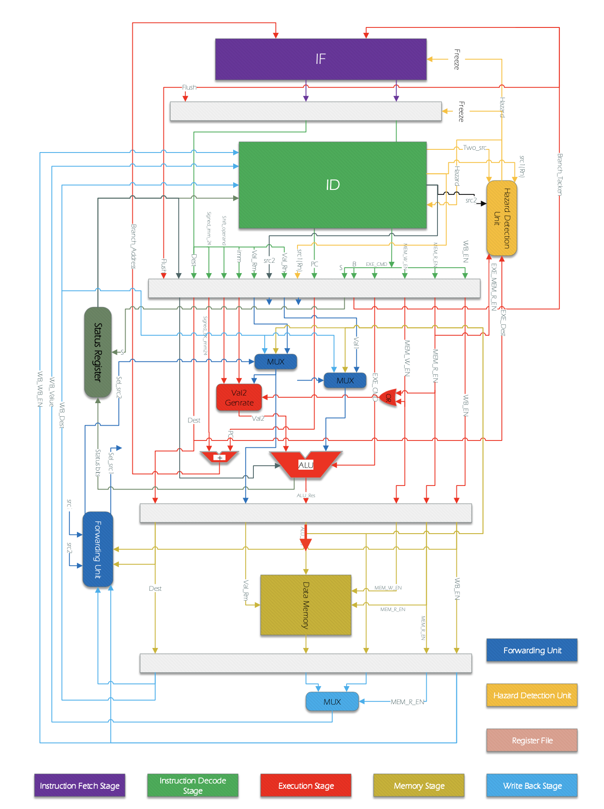
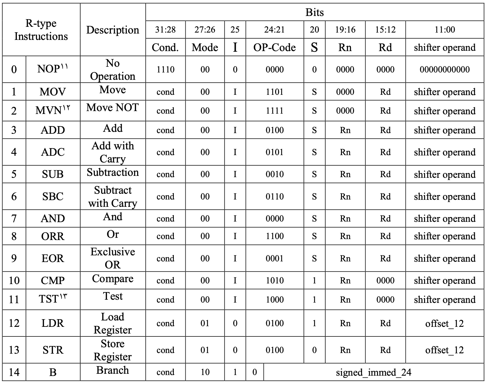

# ARM

This repository contains a simple implementation of ARM based processors using verilog hardware language.

## Features 
* Pipeline
* Hazard Detection
* Forwarding Unit

## Implementation 

The implementation of this project took place in different phases from implementing the whole pipeline to hazard detection and forwarding unit. 

### Data Path

### Instruction Set

